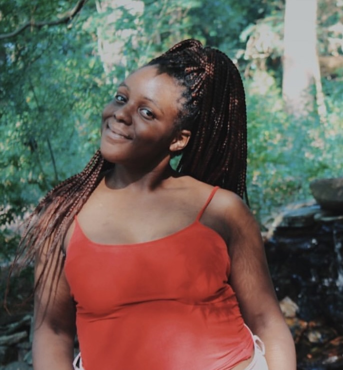
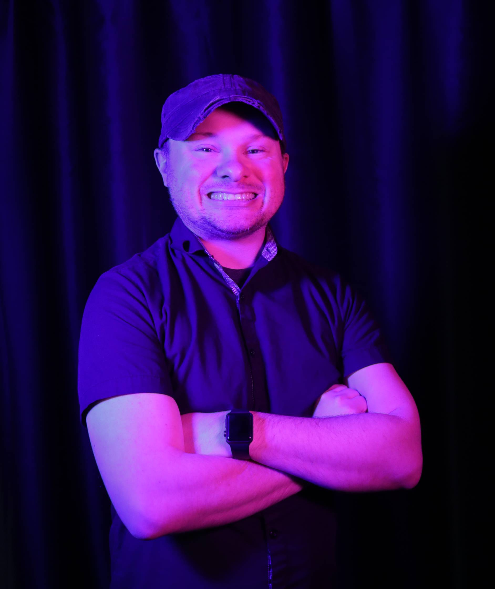
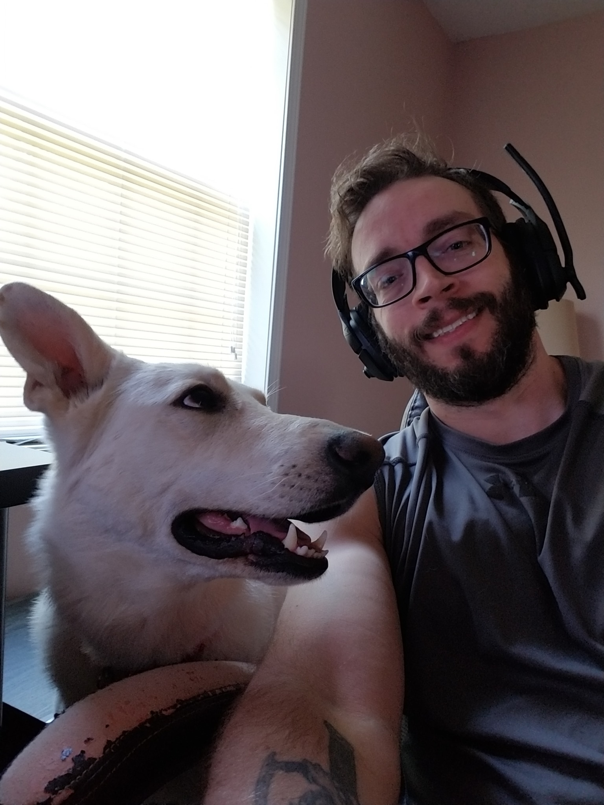
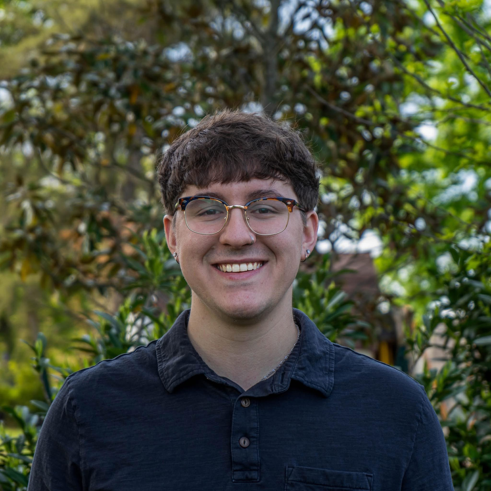
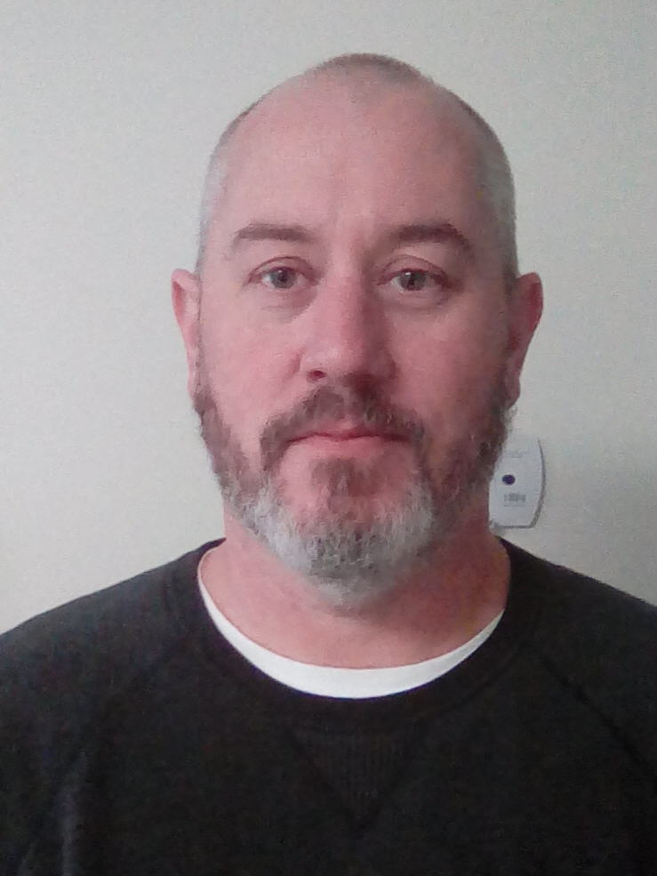
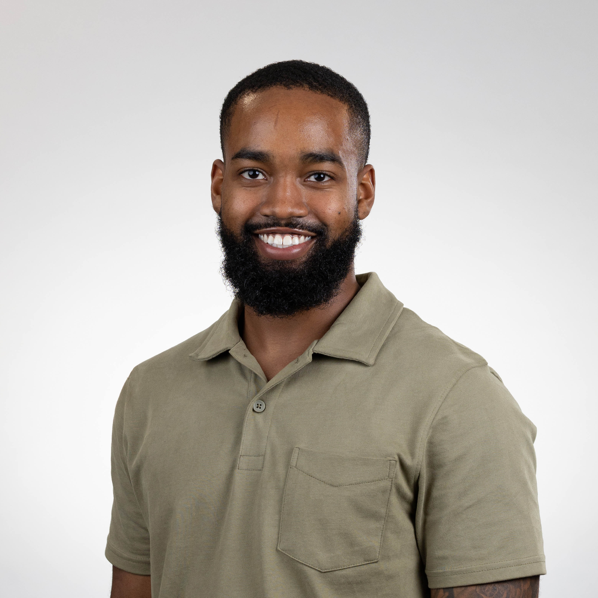
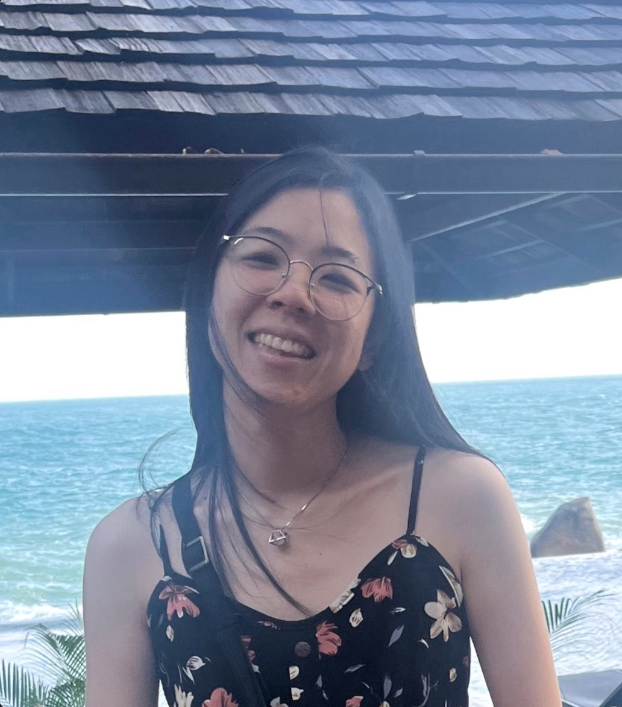
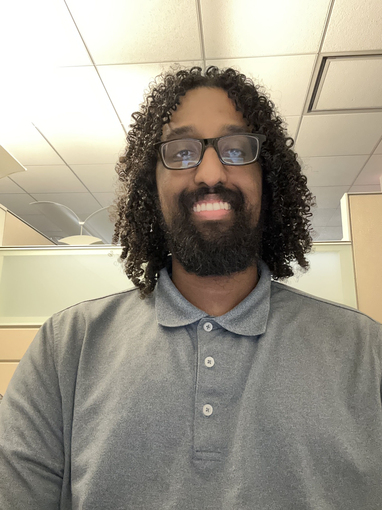
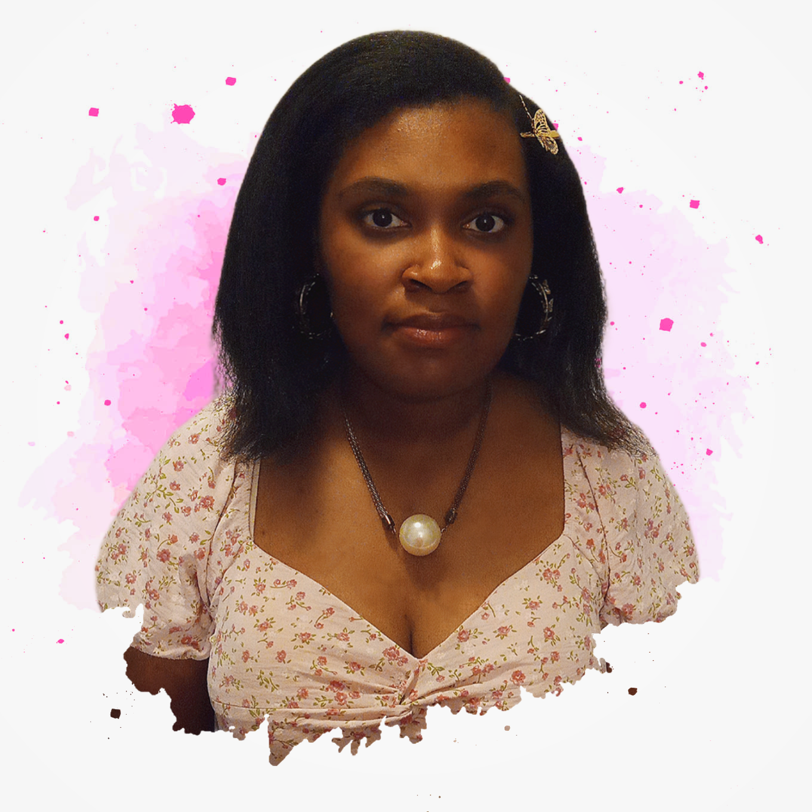

# Meet the Team
Welcome to our team bios page, we're a group of passionate developers, designers, and innovators!

---

    

        
        

            
Priscilla Cook - <i>Project Manager & Developer</i>

            
Born in Slidell, Louisiana and raised along the East Coast, Priscilla brings adaptability, leadership, and drive to the team. Inspired by her experiences growing up in a military-influenced environment and her journey into motherhood, she chose a career in computer science to create a better future for her family. Priscilla excels in organizing tasks, coordinating people, and making sure every team member is set up for success. Her favorite part of development is team orchestration and problem-solving. She is a wife and mother of three, and is motivated daily by her family. She is passionate about building tools that empower others, especially renters advocating for better housing.

        

    

    

        
        

            
Wes Brown - <i>UI/UX Designer & Front-End Developer</i>

            
Raised between New England and northern Virginia, Wes brings a blend of northern creativity and southern sensibility to the team. He has a passion for user experience and visual design, and he strives to build apps that are intuitive, beautiful, and user-focused. Wes enjoys architectural planning, UI and UX work, and front-end development. He values both visual appeal and functionality. Wes is also an accomplished 3D artist with skills in modeling and texturing. He is inspired by creating things that did not exist before and watching others interact with his work.

        

    

    
    

        
        

            
Brian Stiles - <i>Backend Developer & Systems Specialist</i>

            
Brian was born and raised in the small town of Riner, located in southwest Virginia. His interest in computers began at a young age and grew stronger after taking a computer science course in high school. Since then, he has built a diverse background in both technical and hands-on roles. He served in the U.S. Navy as an Electrician's Mate, worked as an Equipment Support Technician at Micron, and later became a Systems Developer for AWS. Brian prefers backend development but also brings full-stack experience to the team. He is motivated by the work ethic of his father, who he considers one of the hardest working people he knows. Brian hopes this project helps the entire team grow as developers and prepares them for success in their future careers.

        

    

    
    

        
        

            
Zach Boudreaux - <i>DevOps Engineer & Automation Enthusiast</i>

            
Zach is a senior majoring in Computer Science with a strong interest in streamlining and improving workflows. He currently works as a DevOps Engineer at Leidos, where he focuses on automating repetitive and time-consuming processes. His passion lies in building systems that make life easier for users and teams alike. Outside of work and school, Zach enjoys spending time outdoors with his dogs and family. He also has a love for travel and photography, always looking for new places to explore and capture through his lens.

        

    

    

    

        
        

            
Shawn Maybush - <i>Data Specialist & Developer</i>

            
Growing up in Richmond, Virginia with a single mom taught Shawn independence and fearlessness. His passion for AI and robotics took off after witnessing innovations by Boston Dynamics and Google. With strong skills in data science, mathematics, and hardware tinkering, Shawn is the team's “mad scientist,” always eager to dive into research and development. His favorite part of the process is solving real-world problems with innovative solutions. A fun fact about Shawn is that he is currently building an off-road Jeep. He draws inspiration from visionaries like Astro Teller and the DeepMind team, and thrives in high-performing, collaborative groups like this one.

        

    

    

        
        

            
Zachery Hendrickson - <i>Developer & Problem Solver</i>

            
Originally from Pompano Beach, Florida, Zach developed resilience and a strong work ethic growing up. His background as a Machinist Mate in the Navy helped shape his problem-solving mindset and inspired his transition into computer science. He enjoys troubleshooting and the satisfaction of making things work. Although he is still gaining experience in front-end development, Zach is eager to improve and contribute wherever needed. He has traveled the world by sea and now brings that same adventurous spirit to technology. Zach is proud of how far he has come and is on track to graduate with his degree in just three years.

        

    

    

        
        

            
Alisa Smanpongse - <i>Organizer & Data Specialist</i>

            
Alisa was born and raised in Los Angeles County, where exposure to diverse cultures and experiences shaped her open-minded and collaborative perspective. She originally developed an interest in computer science through her love of video games, but her focus has since shifted toward data-driven problem solving. Alisa brings strong organizational skills to the team, helping create clear project roadmaps and contributing to smoother workflows. She enjoys the collaborative process of app development, especially working with the team to refine and improve the project each week. Alisa hopes the final product will encourage more mindful and community-oriented living spaces. Outside of tech, she enjoys DIY projects and is currently interested in learning how to weld. She finds motivation through her partner and cousin, and takes pride in using her skills to create solutions and gain independence.

        

    

    

        
        

            
Yahya Mohamed - <i>Backend Developer & Research Lead</i>

            
Born and raised in Alexandria, Virginia, Yahya discovered his love for computer science in high school. He was drawn to the problem-solving aspect and the complex work that goes into creating software and websites. His strengths lie in backend development and research. He brings knowledge from his coursework and is eager to continue growing in this area. Yahya has never traveled outside the country, but he hopes to step out of his comfort zone and explore the world after graduation. He is inspired by how much he has grown through his studies and looks forward to continuing that journey.

        

    

    

        
        

            
Christiney Ponton - <i>Design Enthusiast & Team Creative</i>

            
Christiney was born in Suffolk, Virginia and raised in a rural environment. This helped her develop a curious mind and a desire to explore beyond her hometown. Her interest in artificial intelligence led her to choose computer science as a major. She brings creative energy to the team, especially through her love of design. Christiney is looking forward to strengthening her front-end and back-end skills throughout this project. Outside of school, she creates ASMR content for her YouTube channel and is starting an Etsy shop to sell handmade resin jewelry. She is motivated by her own growth and determination to succeed, especially with the cost of college as a driving force.

        

    

